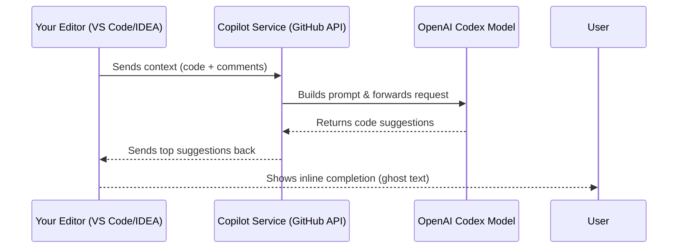
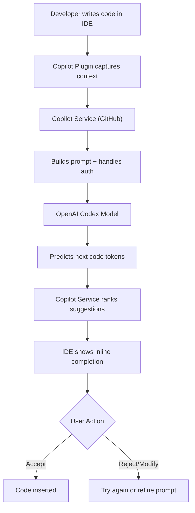

# How GitHub Copilot Works Internally 🤖

GitHub Copilot is more than just an autocomplete tool — it’s an **AI pair programmer** powered by large language models (LLMs) trained on billions of lines of code.  
This page gives you an inside look at how it works under the hood.

---

## 🏗️ High-Level Architecture

1. **Editor Plugin (Client Side)**
   - Runs inside your IDE (VS Code, IntelliJ, JetBrains, Neovim).
   - Captures the code you’re writing, recent context (few hundred lines), and your comment prompts.
   - Sends this context securely to GitHub’s Copilot service.

2. **Copilot Service (Middleware)**
   - Receives your code context from the IDE.
   - Prepares and formats a **prompt** for the AI model.
   - Manages caching, rate limiting, and authentication (your GitHub account token).

3. **AI Model (Server Side)**
   - Uses OpenAI’s **Codex** (a GPT-based model fine-tuned on source code).
   - Predicts the next likely sequence of code or text.
   - Returns multiple candidate suggestions to the Copilot service.

4. **Editor Integration**
   - Your IDE shows the **top suggestion inline** (ghost text).
   - Alternative suggestions are available via keybindings (`Alt+[` and `Alt+]` in VS Code).
   - You accept, reject, or modify the code.

---

## 🔄 Flow Diagram (Sequence)

---

## 🔄 Flow Diagram (Flowchart)

---

## 📦 Context & Prompting

- Copilot can “see”:
  - The **file you are editing**.
  - A few hundred lines **above and around the cursor**.
  - Some context from **other open tabs**.
  - Your **comments** and function signatures.

- Copilot cannot:
  - Access your full repo instantly (only via surrounding context).
  - Run your code or test outputs.
  - Remember long-term history across sessions.

👉 This is why **good prompts matter** — descriptive comments and meaningful names give the AI stronger context.

---

## 🛡️ Security & Privacy

- Copilot suggestions are generated from patterns it learned during training.
- Your code is **not added to the training data** directly.
- GitHub provides filters to block copying large chunks of verbatim code from public repos.

---

## ⚡ Why It Feels Like Magic

Copilot isn’t “understanding” code the way a human does.  
It’s performing **statistical next-token prediction** at massive scale, but because it has been trained on so much real-world code, it often:
- Suggests idiomatic patterns.
- Auto-generates boilerplate (getters, setters, tests).
- Anticipates the next step in your workflow.

---

## 🎯 Summary

- Copilot = **IDE plugin + cloud service + AI model (Codex)**.  
- It works by turning your context into a **prompt** → AI predicts → suggestions returned.  
- Stronger context = better results.  
- It boosts productivity but still needs human oversight.  

👉 Use it as a **coding partner**, not a replacement.
